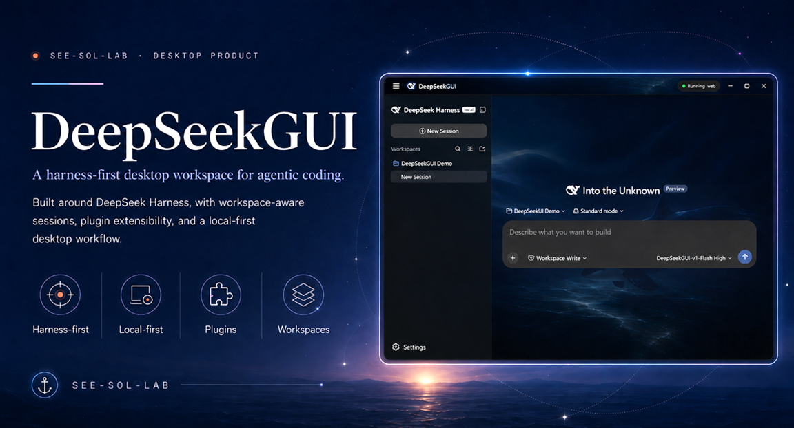
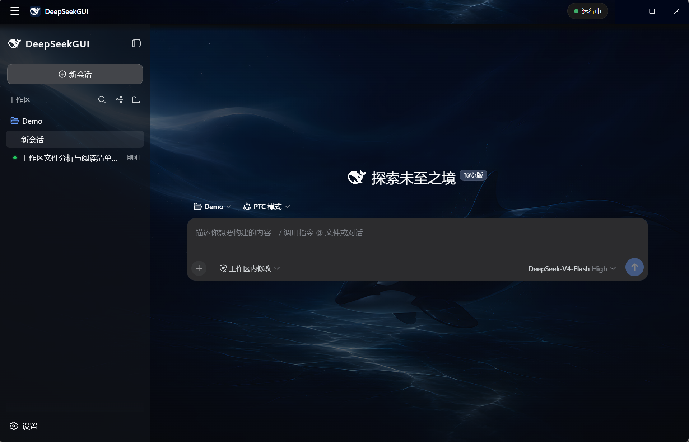
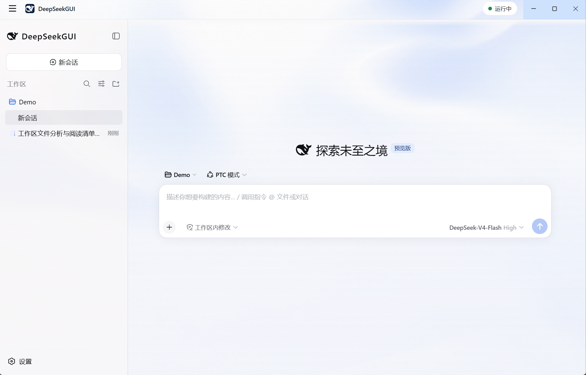
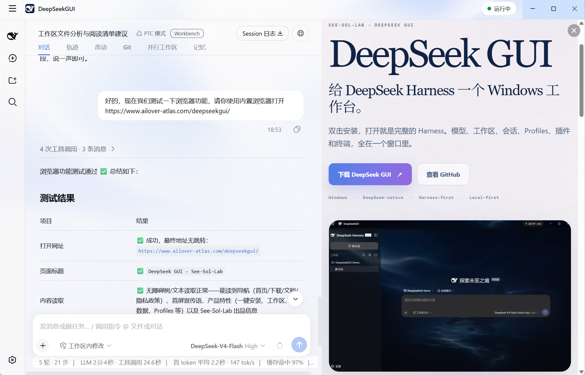
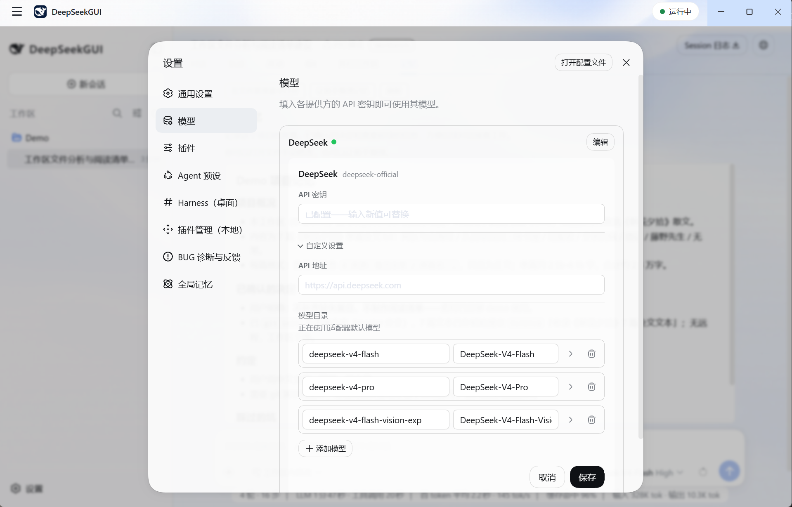
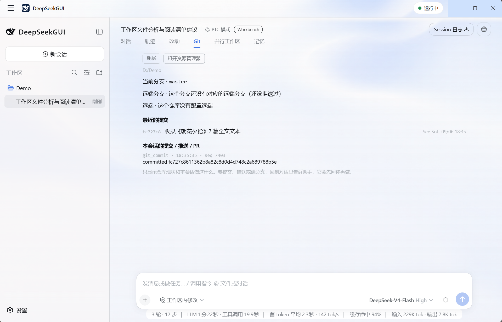
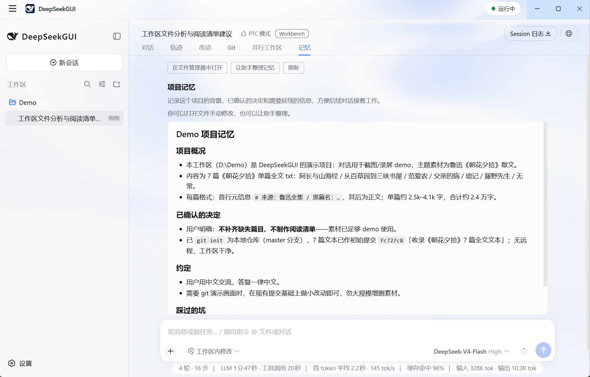
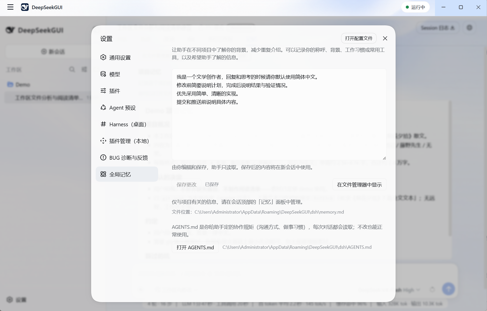

<div align="center">

#  DeepSeekGUI

</div>

<div align="right">

[English](README.en.md) | 中文

</div>

<p align="center">
  <em>在本地工作台中，与 DeepSeek 一起完成项目。</em>
</p>

<p align="center">
  基于 <a href="https://github.com/deepseek-ai/deepseek-harness">DeepSeek Harness</a>，面向 Windows 与 Linux 的本地桌面工作台。
</p>

<p align="center">
  <a href="https://github.com/See-Sol-Lab/DeepSeekGUI/releases/latest"></a>
  <a href="https://github.com/See-Sol-Lab/DeepSeekGUI/releases"></a>
  
  <a href="https://github.com/See-Sol-Lab/DeepSeekGUI/releases/tag/v1.1.0-linux.1"></a>
  <a href="DEEPSEEKGUI-LICENSE.md"></a>
  <a href="https://doi.org/10.5281/zenodo.22205160"></a>
</p>

<p align="center">
  <a href="https://dshfind.com/zh/plugins/See-Sol-Lab/DeepSeekGUI?ref=badge"></a>
</p>

<p align="center">
  
</p>

<!-- PRODUCT HUNT BADGE SLOT — 等 launch 有排名后恢复（在那之前 badge 显示 "???"）：
<p align="center">
  <a href="https://www.producthunt.com/products/deepseekgui?embed=true&amp;utm_source=badge-featured&amp;utm_medium=badge&amp;utm_campaign=badge-deepseekgui" target="_blank" rel="noopener noreferrer">
    <picture>
      <source media="(prefers-color-scheme: dark)" srcset="https://api.producthunt.com/widgets/embed-image/v1/featured.svg?post_id=1235736&amp;theme=dark" />
      
    </picture>
  </a>
</p>
-->

DeepSeekGUI 是基于 [DeepSeek Harness](https://github.com/deepseek-ai/deepseek-harness) 的本地 AI 工作台。选择项目文件夹，在会话中让助手读取代码、修改文件、运行命令和浏览网页；通过「改动」「Git」「并行工作区」「记忆」视图检查项目状态，用专用工具完成提交、推送与 Pull Request，并通过全局记忆和项目记忆延续协作。

发行包自带运行时，配置模型 API key 后即可开始。

**非官方产品：** 基于 DeepSeek Harness 构建，由第三方独立开发，与 DeepSeek 无隶属关系，未获官方背书。

**当前版本：[v1.1.0](https://github.com/See-Sol-Lab/DeepSeekGUI/releases/tag/v1.1.0)。** 本地 Workbench、Git / PR 工具、两层记忆和桌面通知已发布。工作台通过插件扩展官方 Harness 客户端，继续使用 Harness 的会话、工具与权限机制。

## 下载

| 平台 | 下载 | 要求 |
| --- | --- | --- |
| Windows | [下载安装包](https://github.com/See-Sol-Lab/DeepSeekGUI/releases/download/v1.1.0/DeepSeekGUI-Setup-1.1.0.exe) | Windows 10/11，x64 |
| Linux | [下载 AppImage](https://github.com/See-Sol-Lab/DeepSeekGUI/releases/download/v1.1.0-linux.1/DeepSeekGUI-1.1.0-x86_64.AppImage) | x64，AppImage；实验性支持 |

Windows 安装包安装到当前用户目录，自带运行时。Linux 使用独立的 AppImage 发行文件，下载与校验信息见 [v1.1.0-linux.1](https://github.com/See-Sol-Lab/DeepSeekGUI/releases/tag/v1.1.0-linux.1) 发布页。

> **Windows 安装提示：** 安装包尚未进行代码签名，SmartScreen 可能提示发布者未知。核对下载来源和 SHA256 后，可通过 **“更多信息” → “仍要运行”** 继续安装。

<details>
<summary>校验 Windows 安装包</summary>

下载安装包后，在 PowerShell 中计算 SHA256：

```powershell
Get-FileHash .\DeepSeekGUI-Setup-1.1.0.exe -Algorithm SHA256
```

与 [`SHA256SUMS.txt`](https://github.com/See-Sol-Lab/DeepSeekGUI/releases/download/v1.1.0/SHA256SUMS.txt) 核对后再安装。遇到问题看[故障排查指南](docs/user/deepseekgui/data-troubleshooting.zh.md#windows-smartscreen-blocks-the-installer)。

</details>

## 快速开始

1. 安装 DeepSeekGUI，打开它。
2. 进入 **设置 → 模型**，填入你的 DeepSeek API key。
3. 选择模型；需要处理图片时，选择支持视觉的模型。
4. 回到主页，选择一个工作区文件夹。
5. 开始会话并说明任务；在「改动」中检查文件差异，在「Git」中查看仓库状态与操作结果。
6. 按需在 **设置 → 全局记忆** 保存协作偏好，在会话的 **记忆** 视图查看和整理项目记忆。

详细步骤见[快速开始指南](docs/user/deepseekgui/quickstart.zh.md)。

## 为什么用 DeepSeekGUI

**项目状态看得见。** 对话旁边就能查看文件改动、分支、提交和 worktree，无需为每次状态检查请求模型。

**协作经验留得住。** 全局记忆保存跨项目偏好，项目记忆记录决策、约定和修正，两者分别管理。

**操作过程可检查。** Git、PR 和浏览器工具用结果卡片展示摘要与详情；提交、推送等操作通过 Harness 审批，权限模式由你选择。

**浏览过程可见。** 内置浏览器展示助手正在访问的页面，敏感交互遵循 Harness 审批规则。

**本地保存，按需联网。** 会话、凭据、设置和记忆保存在本地，模型请求发送到你配置的服务。

**基于 Harness 扩展。** 使用原生 Profile、插件、钩子和 CLI，工作台与对话共用同一运行时。

## 截图

| 深色主题 | 浅色主题 |
| --- | --- |
| [](docs/user/deepseekgui/assets/workbench-dark-1.1.0.png) | [](docs/user/deepseekgui/assets/workbench-light-1.1.0.png) |

*同一个本地工作台，两种主题。点击图片可查看原始尺寸。*



*在会话旁边打开网页，查看助手的浏览操作和结果，让对话与页面内容保持并列。*



*在统一设置中配置模型，并访问 Harness 桌面控制、本地插件管理、诊断反馈与全局记忆。*



*查看当前分支、远端配置、最近提交，以及本会话的 Git 操作记录。*



*在项目中保留背景、已确认的决定和协作约定，以 Markdown 阅读，也可让助手整理。*



*跨项目的个人偏好由用户编辑和保存，助手读取；项目事实在单独的项目记忆中管理。*

## 工作台功能

### 本地项目与 Git 协作

- **改动视图** — 按将提交、已改动、新文件和冲突分组查看文件，打开单文件差异、复制路径或在文件管理器中定位。
- **Git 视图** — 查看分支、远端同步状态、最近提交，以及已加载会话记录中的提交、推送和 PR 结果。
- **并行工作区** — 查看已注册 worktree 的分支和改动，识别多个工作区共同修改的文件路径。
- **Git / PR 工具** — 通过会话查询差异、暂存、取消暂存、撤销已跟踪文件的未暂存改动、提交、预览推送、推送和创建 PR；结果以专用卡片展示。
- **本地状态检查** — 视图按需读取工作区状态，无需模型请求；工作区文件路径可点击定位，内置终端可跟随当前会话目录。

### 记忆与协作规则

- **全局记忆** — 用户在设置页编辑跨项目偏好与协作要求，助手只读。
- **项目记忆** — 助手在工作区的 `<文件夹名>.memory.md` 中维护项目事实；记忆视图支持 Markdown 阅读和「让助手整理」。
- **规则模板** — 托管目录首次启动时初始化全局 `AGENTS.md`，项目模板可按需生成；已有文件保留。
- **可追溯上下文** — 会话加载时读取两层记忆，实际使用的内容随 Harness 会话上下文记录保存。

### 模型与桌面工具

- **模型与图片输入** — 配置 DeepSeek 或自定义模型服务，将截图和图片交给支持视觉的模型。
- **会话与权限** — 在项目文件夹中开始和恢复会话，查看工具执行过程，并通过 Harness 权限模式和审批控制操作。
- **浏览器与终端** — 在可见浏览器中检查网页，通过内置 DSH Terminal 使用当前 Harness 环境。
- **桌面通知** — 接收待审批、待回答及后台任务完成或失败的提示，点击跳转到对应会话。
- **Profile 与插件** — 切换 Harness Home 和 Profile，管理兼容插件，查看配置与运行状态。
- **桌面集成** — 中英双语界面、系统托盘、更新检查与本地诊断。

完整版本变更见 [v1.1.0 发布说明](https://github.com/See-Sol-Lab/DeepSeekGUI/releases/tag/v1.1.0)。

## 文档

| 指南 | |
| --- | --- |
| [快速开始](docs/user/deepseekgui/quickstart.zh.md) | 第一次会话完整流程 |
| [模型与视觉](docs/user/deepseekgui/models.zh.md) | API key、模型配置、图片输入 |
| [工作区与会话](docs/user/deepseekgui/workspaces-sessions.zh.md) | 文件夹、会话管理 |
| [Profile 与插件](docs/user/deepseekgui/profiles-plugins.zh.md) | Harness Profile 和插件管理 |
| [权限与批准](docs/user/deepseekgui/permissions.zh.md) | 沙盒、权限、审批 |
| [桌面工具](docs/user/deepseekgui/desktop-tools.zh.md) | 浏览器、终端、更新、诊断 |
| [数据与故障排查](docs/user/deepseekgui/data-troubleshooting.zh.md) | 数据位置、隐私、常见问题 |

文档里也保留了上游 Harness 的开发教程和插件开发参考。

## 数据与隐私

托管环境中的凭据、设置、会话与全局记忆保存在应用本地数据目录；Windows 默认为 `%APPDATA%\DeepSeekGUI\dsh`。项目记忆保存在所选工作区的 `<文件夹名>.memory.md` 中。模型请求会将当前任务所需的上下文发送到你配置的模型服务；浏览网页、Git / PR、插件管理和更新检查也会访问相应网络服务。

日志对凭据类内容进行脱敏，诊断文件保存在本地。Windows 卸载程序会询问是否删除应用数据；覆盖升级保留数据。分享诊断或提交项目记忆文件前，请检查其中是否包含私密内容。

## 从源码构建

<a id="run-deepseekgui-from-source"></a>

### 从源码运行 DeepSeekGUI

需要仓库指定版本的 Node.js 和 pnpm：

```sh
git clone https://github.com/See-Sol-Lab/DeepSeekGUI.git
cd DeepSeekGUI
pnpm install
pnpm run build
pnpm run dev:desktop
```

构建 Windows 发行版：

```sh
pnpm run build:desktop-dist
```

打包细节见 [DeepSeekGUI Desktop](apps/desktop/README.zh.md)。

<a id="run"></a>

### 通过 npm 运行 Harness

装好 Node.js，启动上游 Web UI：

```sh
npx @deepseek-ai/dsh web
```

会在浏览器打开 `http://127.0.0.1:3080`。

<a id="run-deepseek-harness-from-source"></a>

### 从源码运行 Harness

公开代码树里有桌面版使用的上游 Harness 源码：

```sh
pnpm install
pnpm run build
pnpm dsh web
```

## 参与贡献

- Bug 和反馈提到 [DeepSeekGUI Issues](https://github.com/See-Sol-Lab/DeepSeekGUI/issues)。
- PR 之前先看 [CONTRIBUTING.md](CONTRIBUTING.zh.md)。
- 上游 Harness 的问题去 [DeepSeek Harness Discussions](https://github.com/deepseek-ai/deepseek-harness/discussions)。

## 许可证

两部分：

- **上游 Harness** 代码继续遵循 DeepSeek 的 [MIT License](LICENSE-MIT-UPSTREAM)。
- **DeepSeekGUI** 原创代码以 [PolyForm Perimeter License 1.0.1](apps/desktop/LICENSE) 源码可见发布。个人、学习、研究、爱好、公司内部用都行；做竞品需要找 See-Sol-Lab 另外拿授权。

根目录 [`LICENSE`](LICENSE) 说明了两部分怎么划分。重新分发前请读 [DeepSeekGUI 许可说明](DEEPSEEKGUI-LICENSE.md)和[第三方声明](THIRD_PARTY_NOTICES.md)。

---

DeepSeekGUI 是公开发布仓库。日常开发在私有仓库里进行，Release 发布的是产品代码树。
