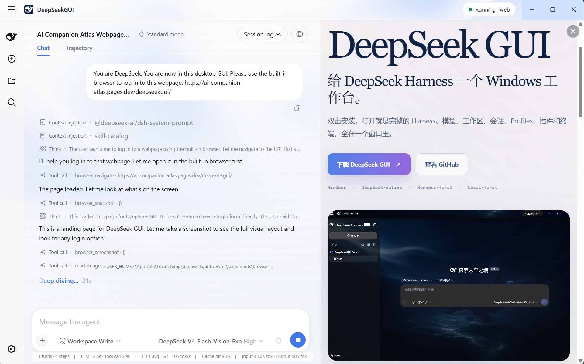

# Desktop tools

English | [中文](desktop-tools.zh.md)

DeepSeekGUI packages the Harness runtime with Windows-native controls for browser work, terminal access, updates, diagnostics, feedback, and resident operation.

## Built-in browser

The DeepSeekGUI browser plugin gives the agent a visible Microsoft Edge window for pages that require real rendering or interaction. It supports navigation, page snapshots, screenshots, tabs, waiting, clicking, typing, scrolling, and keyboard actions.

The browser applies these limits:

- Local, private, and reserved network addresses are refused before navigation.
- Redirect targets are checked again at every hop.
- Arbitrary page-script evaluation is not exposed.
- Form submission, login, message sending, and other sensitive actions require approval.
- Cookies are not persisted in V1.

The Browser Panel appears after the agent opens the browser. Use the DeepSeekGUI menu to show or hide the panel without stopping the browser task.



## DSH Terminal

Open **DSH Terminal** from the DeepSeekGUI menu or system tray. The terminal uses the active Harness Home and prefers the active Profile directory as its working directory.

The packaged application supplies private `dsh`, `node`, and `pnpm` shims to that terminal process. It does not modify the system PATH, registry, PowerShell profile, or shell configuration.

Bare `dsh` commands default to the active Profile. An explicit `--profile` argument always wins.

## Harness controls

The Harness section in Settings shows the active Home, Profile, status, Profile switcher, Plugin Manager, permission controls, recovery details, diagnostics, and feedback. The top status indicator is read-only; use the Harness section for changes.

## Updates

Use **Check for Updates** from the menu or tray. DeepSeekGUI compares only the DeepSeekGUI application version, not the embedded DSH version.

An update download requires confirmation. DeepSeekGUI accepts only HTTPS assets from the configured manifest, enforces the declared size, verifies SHA-256, removes partial downloads after failure or cancellation, and re-verifies the installer immediately before handoff.

The update panel also has an **Auto-download updates** switch, on by default and stored with the desktop preferences. While it is on, DeepSeekGUI starts at most one background download per discovered version. Turning it off stops future automatic downloads without interrupting one already running, and a running download can always be cancelled explicitly.

When the installed version is already the newest published one, a manual check reports that no update is available. The installed version remains usable.

## Diagnostics Center

The Diagnostics Center shows allowlisted product facts and offers two actions:

- **Open Log Folder** opens the local service-log directory.
- **Export Diagnostics Bundle** creates a local bundle under the DeepSeekGUI data directory. DeepSeekGUI does not upload it.

The bundle can include redacted service logs, build information, last-exit facts, and bounded crash dumps. Credentials, `.env` files, and session content are structurally excluded. Crash dumps can still contain local paths or memory fragments, so review every exported file before sharing it publicly.

If the GUI cannot start, run the installed executable from a terminal:

```powershell
DeepSeekGUI.exe --export-diagnostics
```

The command starts no Harness, Profile, window, tray, or local server. It prints the exported bundle path and exits.

## Feedback

The Feedback section can collect an editable, redacted diagnostics summary and prepare a GitHub issue. Review the text before copying, opening, exporting, or submitting it. DeepSeekGUI does not package a personal GitHub token.

## Desktop notifications

DeepSeekGUI raises a desktop notification when a session needs you: a pending approval, a question waiting for an answer, or a background task that finished or failed. Selecting the notification opens the matching session.

Notifications follow the Windows notification settings for the application.

## Tray and lifecycle

DeepSeekGUI is a resident desktop application. Closing the window hides it; opening the shortcut again focuses the existing instance. **Quit DeepSeekGUI** is the action that stops Harness, destroys the tray and views, and exits.

## Related guides

- [Workbench views and Git tools](workbench.md)
- [Profiles and plugins](profiles-plugins.md)
- [Permissions and approvals](permissions.md)
- [Data and troubleshooting](data-troubleshooting.md)
