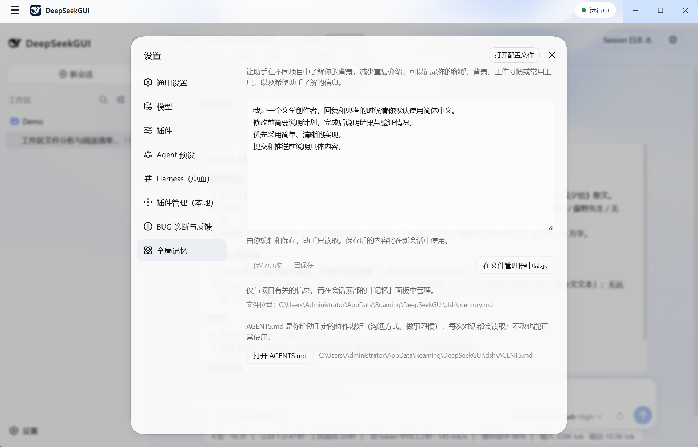
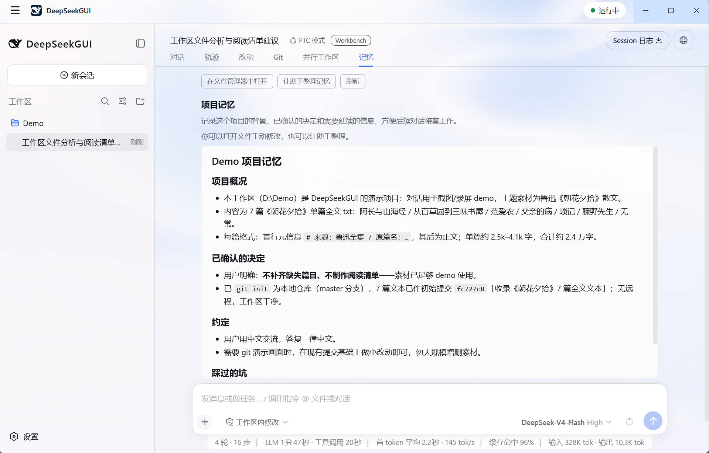

# 记忆

[English](memory.md) | 中文

DeepSeekGUI 用两层记忆保存协作上下文。全局记忆记录你的跨项目偏好，由你编辑；项目记忆记录单个项目的事实，由助手维护。两层分开存储、分开管理。

从 B7 起有两种保存方式：先介绍的 Markdown 文件（仍是默认），或条目——助手按每条消息召回、你可以逐条纠正、遗忘与恢复的带版本小记录。在 **设置 → 全局记忆** 里选择；两种方式绝不同时生效，随时可以切回。

## 全局记忆

全局记忆保存在当前 Harness Home 的 `memory.md`，供使用该 Home 的项目读取。保存后的内容用于新加载的会话；保存时会检查 Home 和原文是否改变，避免覆盖外部修改。

- 在 **设置 → 全局记忆** 中编辑。助手读取并遵循这份文件，内容由你决定。
- 适合放长期偏好：语言、代码规范、审查要求，以及你希望每个会话都遵守的协作规则。

## 项目记忆

项目记忆以 `<文件夹名>.memory.md` 的形式保存在所选工作区里，与它描述的项目文件放在一起。

- 助手在会话中维护它：项目背景、已确认的决定、协作约定。
- 在会话中打开 **记忆** 视图，以渲染后的 Markdown 阅读，视图提供固定高度的阅读窗口。
- 文件变得冗长时，使用 **让助手整理**。阅读面板最多展示前 20,000 个字符，超出时提示截断；这不是磁盘文件的容量限制。
- 这份文件就是项目里的普通 Markdown：你可以直接编辑、纳入版本控制审阅，并确切看到助手记录了什么。

## 条目记忆（可选）

**设置 → 全局记忆** 的标题就是当前模式：旧版下显示「全局记忆（旧版）」，一个按钮开启增强记忆（实验性）；开启后显示「增强记忆（实验性）」，一个按钮回到旧版。切换要确认，确认文案写明会变什么：切到增强后旧文件保留但不再读取；切回后条目保留但不再召回；两份不会同时生效，也不会自己切换。已打开的会话从下一条消息起生效，已发出的内容不会撤回。

开启条目后：

- 助手在每条消息前召回与之相关的条目——你的全局偏好和本项目的事实——并用自己的工具记下你确认过或它验证过的内容，附上依据。你说出一条全局偏好时它直接写入，没有审批步骤，因为每条条目都可见、可撤销。
- 会话里的 **记忆** 视图列出本项目与全局的条目：搜索、展开查看来源（谁、哪个会话、何时、依据什么）与修改历史、编辑、遗忘、撤销最近修改，或恢复已遗忘的条目。**本轮用了哪些记忆** 折叠展示模型确切看到的条目（编号与版本）以及它此后有没有变。
- 设置 → 全局记忆里是同一份列表的全局部分，外加 **导入** 与 **导出**。
- **导入** 预览一份旧文件——设置里是 `memory.md`，记忆视图里是项目的 `<文件夹名>.memory.md`——切成段落供你勾选后写入；已在库中的段会标出。预览不写入，文件绝不被修改。
- **导出** 把条目生成为 Markdown 文本，由你复制保存到任何地方；绝不写回旧文件。
- 过期的编辑会被拒绝：如果另一个窗口先改了同一条，页面会显示当前版本并请你重新载入后再改。写入落盘之前不会显示已保存。
- 接续记录是助手对一项任务的交接——目标、确认过的决定、未完成项、线索，以及当时验证过什么。停下时让它保存进度；之后继续时它会召回记录、重新核对文件与 Git，等你开口再动手。

删除会话会保留它写下的条目，条目会注明来源会话已删除。遗忘由你决定——在页面上操作，或让助手去做。

## 规则模板

全新托管 Home 首次启动时，DeepSeekGUI 会初始化全局 `AGENTS.md` 规则文件；项目级模板可按需生成。初始化只补齐缺失的文件，已有文件一律原样保留。

## 记忆如何进入会话

使用 Markdown 文件时，会话加载时 Harness 在预算范围内把两层记忆注入模型上下文；使用条目时，每条消息前召回相关条目，作为一份替换上一份的小清单注入。无论哪种，实际注入的内容都随 Harness 会话上下文一起记录，模型收到了什么可以追溯核对。

项目记忆是模型上下文的一部分，请像对待其他项目文件一样对待它：公开项目或随报告分享之前，先检查其中的内容。

## 相关指南

- [工作台视图与 Git 工具](workbench.zh.md)
- [工作区与会话](workspaces-sessions.zh.md)
- [数据与故障排查](data-troubleshooting.zh.md)
