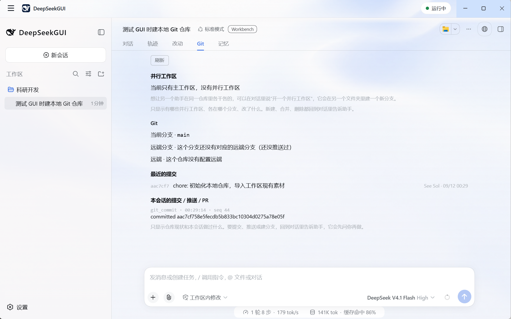

# 工作台视图与 Git 工具

[English](workbench.md) | 中文

工作台位于会话旁边，展示项目的实际状态：文件改动、仓库状态、并行工作区和记忆。视图按需读取本地状态，检查项目不消耗模型请求。

本指南介绍「改动」「Git」视图及 Git 页内的并行工作区区域，以及专用 Git / PR 工具。「记忆」视图见[单独的指南](memory.zh.md)。

## 改动视图

改动视图列出当前工作区改动过的文件，按将提交、已改动、新文件和冲突分组。

对每个文件可以：

- 打开单文件差异，在会话旁边阅读。
- 复制文件路径。
- 在文件管理器中定位文件。

提交之前，用改动视图审阅助手的编辑。差异展示磁盘上的真实工作树，你自己做的修改同样会反映在这里。

## Git 视图

Git 视图展示工作区背后的仓库：

- 当前分支与远端同步状态。
- 最近提交。
- 已加载会话记录中的提交、推送和 Pull Request 结果。

历史部分读取会话记录，助手在复合工具调用内部执行的 Git 操作同样会被列出。重新打开会话即可恢复其中记录的 Git 历史。

## Git 页中的并行工作区

Git 视图上方的并行工作区区域列出已注册 Git worktree、分支与改动摘要。多个 worktree 修改同一路径时会标出重叠，提醒检查潜在冲突；路径重叠本身不代表合并必然冲突。

本版本中该视图为只读。创建和删除 worktree 请使用你惯用的 Git 工具。

## Git / PR 工具

助手通过专用 Git 工具完成仓库操作，而非裸的 shell 命令。在会话中可以让它：

- 查询差异。
- 暂存与取消暂存文件。
- 撤销已跟踪文件的未暂存改动。
- 提交。
- 预览推送、推送、创建 Pull Request。

提交、推送、创建 PR 和撤销未暂存改动会请求 Harness 审批；暂存与取消暂存遵循当前写入权限。结果以专用卡片在会话中展示，摘要可展开查看详情。

批准之前请阅读请求内容，与对待文件编辑和命令执行相同。审批模型见[权限与批准](permissions.zh.md)。

## 使用视图

- 视图在打开时从本地工作树刷新。它们观察仓库本身，数据始终以磁盘上的仓库为准。
- 会话中的工作区文件路径可点击，直接打开文件位置。
- 内置 DSH Terminal 可跟随当前会话目录，手动执行的 Git 命令与视图描述的是同一个位置。

## 相关指南

- [记忆](memory.zh.md)
- [工作区与会话](workspaces-sessions.zh.md)
- [权限与批准](permissions.zh.md)
