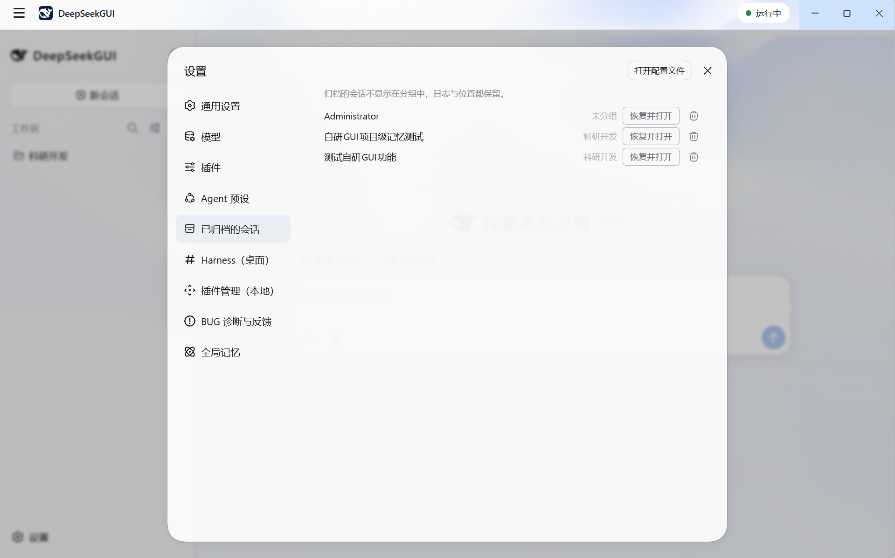

# Workspaces and sessions

English | [中文](workspaces-sessions.zh.md)

A workspace tells Harness which project a session is working on. A session keeps the conversation, tool events, and resumable state for that work.

## Choose a workspace

Select a project folder from the DeepSeekGUI home page before creating a session. The workspace becomes the default working directory for the agent and its tools.

In the recommended Sandbox mode, the workspace is also the normal writable boundary. A tool may read or write only what the active Harness permission policy allows; choosing a folder does not grant Full Access to the rest of the computer.

Use a dedicated project folder rather than a broad location such as your user profile or an entire drive. Version control or a disposable copy makes review and recovery easier.

## Start a session

Create a new session inside the selected workspace. Give the agent:

- One concrete outcome.
- Relevant constraints, such as files it must not change.
- The verification you expect before it finishes.

For a first pass, ask the agent to inspect and report before editing. Once the scope is correct, request the change in the same session so the established context remains available.

## Resume a session

DeepSeekGUI stores sessions through Harness in the active Harness Home. Reopen a previous session from the session list to continue with its recorded conversation and events.

Sessions are stored in the Harness Home in use. Switching Homes reads history from the selected directory; returning to the original Home restores access to its sessions. Switching Profiles does not copy sessions into another Home.

## Archive and restore a session

Archiving hides a session from its workspace list while retaining its log. Open **Settings → Archived Sessions** and choose **Restore and open** to return it to its group; deletion requires two-step confirmation.

Deletion waits for the current reply and tools, removes messages, attachment references, and search indexes, and retains the ID, title, deletion time, and workspace access metadata. Exact ID or matching-title queries can return a deleted record; shared attachment files remain available to other sessions.

## Attach files and images

Upload general files with a message; image attachments require a model that supports image input. For files already in the project, you can give the assistant a path instead of pasting their full contents.

Attachments become model input only through Harness. DeepSeekGUI does not keep a second attachment database.

## Review agent work

Ask the agent to summarize changed files and verification results. Open the **Changes** view to read the file diffs and the **Git** view to confirm branch state and recorded commits; both read local state without a model request. Use version-control review for source changes, and inspect tool approvals before allowing actions outside the ordinary workspace workflow. See [Workbench views and Git tools](workbench.md).

An interrupted running turn does not erase the saved session history. The current operation may stop when Harness restarts or DeepSeekGUI quits, but the recorded conversation remains on disk.

## Window and tray behavior

Closing the main window hides DeepSeekGUI to the system tray. Harness and any current task continue running. **Quit DeepSeekGUI** stops Harness and can interrupt the active task, so DeepSeekGUI asks for confirmation before exiting.

## Related guides

- [Workbench views and Git tools](workbench.md)
- [Memory](memory.md)
- [Permissions and approvals](permissions.md)
- [Data and troubleshooting](data-troubleshooting.md)
